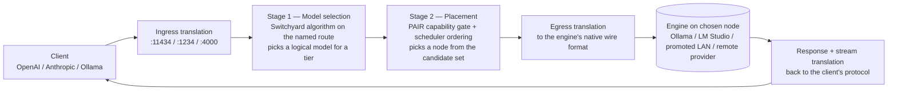

<!--
SPDX-FileCopyrightText: Copyright (c) 2026 Karl Miller
SPDX-License-Identifier: Apache-2.0
-->

# Yardmaster

Yardmaster is a **two-stage LLM router** for a group of computers on the same
network. It merges two NVIDIA projects into one system: [NeMo
Switchyard](https://github.com/NVIDIA-NeMo/Switchyard) decides *which model* a
request should use, and [Personal AI Router
(PAIR)](https://github.com/NVIDIA/Personal-AI-Router) decides *which node* runs
it. The two decisions are orthogonal; Yardmaster composes them and keeps PAIR's
product shape: install, pair with a six-digit PIN, add a model, point an app at
one local endpoint, watch jobs.

Prompts and responses stay on the local network by default. Off-LAN providers
exist but are disabled until you turn them on in the config file *and* the
desktop UI.

> Yardmaster routes each independent request to one model on one node. It does
> **not** pool GPU memory, combine GPUs into a larger logical GPU, shard one
> model across machines, or split an in-flight request between nodes.

<!-- TODO(screenshot): replace assets/yardmaster-demo.png with a real capture of
     the Overview + Routes + Jobs views once the desktop additions land. -->

## The two-stage router in one paragraph

Every request is translated into Switchyard's provider-neutral protocol, then
**model selection** runs: the request's `model` field names a Switchyard route,
whose typed algorithm (`passthrough`, `random`, `stage_router`, `llm_classifier`,
`escalation`, or Yardmaster's `plan_execute`) picks a *logical model name* for a
tier — `qwen4:12b`, `nemotron-3.5-lightning`, `openrouter/anthropic/claude-...`.
Then **placement** runs: that logical model is resolved against the live cluster,
nodes whose running engine advertises it form the candidate set, PAIR's
model-blind scheduler orders them, and the request is forwarded to the first
candidate with PAIR's existing 404-is-retryable failover. Finally the response is
translated back to whatever protocol the client spoke. A bare model name that is
not a configured route falls through as a `passthrough` route, so PAIR's
"point curl at `:11434` with `qwen4:12b`" flow works unchanged with no config
file present.

## What is supported

| | |
| --- | --- |
| **Operating systems** | Windows 11; Linux; macOS |
| **Architectures** | x64 and arm64 |
| **Managed inference engines** | Ollama and LM Studio (installed and supervised, exactly as in PAIR) |
| **Discovered engines** | Ollama, LM Studio, vLLM, llama.cpp, NIM, generic OpenAI-compatible — routing targets only, never installed or supervised |
| **Client protocols in** | OpenAI Chat (`/v1/chat/completions`), OpenAI Responses (`/v1/responses`), Anthropic Messages (`/v1/messages`), Ollama native (`/api/chat`, `/api/generate`, `/api/tags`, `/api/show`) |
| **Routing algorithms** | `passthrough`, `random`, `stage_router`, `llm_classifier`, `escalation` (from Switchyard); `plan_execute` (Yardmaster) |
| **Remote provider kinds** | `openrouter`, `venice`, `kie`, `openai_compatible` — off by default |
| **Agent framework** | DeepSeek Harness (`dsh`), shipped as the default agent experience via a plugin |

**Yardmaster running on a machine does not mean an engine will.** Each engine
sets its own OS, GPU, and driver requirements, and each model needs enough memory
to load. A node becomes a candidate for a request only once it is actually
running a compatible engine that advertises the model.

## Quick start

The recommended path is a released desktop build. Building from source and the
terminal interface exist for changing Yardmaster and for machines with no
desktop; see [docs/architecture.md](docs/architecture.md) and
[docs/migrating-from-pair.md](docs/migrating-from-pair.md).

1. **Install** on two or more machines on the same LAN.
2. **Pair** them: one machine shows a six-digit PIN, the other enters it. This
   is the unchanged PAIR pairing flow and builds the mTLS cluster.
3. **Add a model** on a node through its managed engine (Ollama or LM Studio).
4. **Point an app** at one machine's local endpoint — `http://localhost:11434`
   (Ollama-compatible), `http://localhost:1234/v1` (OpenAI-compatible), or
   `http://localhost:4000/v1/messages` (Anthropic Messages). Existing clients
   gain the cluster unchanged.
5. **Send a request.** With no `yardmaster.toml`, a bare model name is a
   `passthrough` route and behaves exactly like PAIR.
6. **Start the agent.** Open the **Agent** tab and press **Start Harness** (or
   run `dsh headless --profile yardmaster-headless "<task>"` from the TUI). This
   launches DeepSeek Harness with the Yardmaster profile as the default agent
   experience, using the cluster as its model substrate.

Add a first route from the **Routes** view when you want model selection — for
example a `plan_execute` route that sends planning turns to a heavier tier and
execution turns to cheap local models. See
[docs/routing.md](docs/routing.md) and [docs/plan-execute.md](docs/plan-execute.md).

## Uninstalling

Yardmaster uses PAIR's installers and data directory. Uninstall the same way you
uninstall PAIR for your platform; remove `yardmaster.toml` and the metrics
database from PAIR's data directory to clear Yardmaster-specific state. Full
steps are in [docs/migrating-from-pair.md](docs/migrating-from-pair.md).

## Documentation

| Document | What it covers |
| --- | --- |
| [docs/architecture.md](docs/architecture.md) | Process model, the data plane worker, the two-stage pipeline, trust boundaries |
| [docs/routing.md](docs/routing.md) | The full `yardmaster.toml` reference, one validated example per algorithm, the decision-trace format |
| [docs/plan-execute.md](docs/plan-execute.md) | Planner / worker / judge tiers, the three tier-hint mechanisms, the signal table, the worked Claude Code example |
| [docs/providers.md](docs/providers.md) | `openrouter`, `venice`, `kie`, `openai_compatible`: config, keys, model listing, pricing, limitations |
| [docs/discovery.md](docs/discovery.md) | What is browsed, what is probed, what is never probed, promotion, turning it all off |
| [docs/metrics.md](docs/metrics.md) | Event schema, Prometheus metrics, OTLP span tree, `metrics.*` JSON-RPC, report format, retention |
| [docs/harness.md](docs/harness.md) | The DeepSeek Harness plugin, its extension points, the default tier policy, the two profiles, the Agent tab, the safety boundary |
| [docs/security.md](docs/security.md) | Trust boundaries, what changed vs PAIR, the egress model, inherited exposures |
| [docs/migrating-from-pair.md](docs/migrating-from-pair.md) | Zero-config path, then adding a first route |
| [docs/migrating-from-switchyard.md](docs/migrating-from-switchyard.md) | Mapping URL targets to `locality = "remote"`, converting a vLLM target into a cluster node |
| [docs/decisions/](docs/decisions/) | Architecture Decision Records |

## Releases

See the [releases page](https://github.com/pakgrou-porg/yardmaster/releases).
Release artifacts are **unsigned**; code signing and notarization are not yet in
scope and the gap is noted in each release's notes.

## Where Yardmaster is going

PAIR's README says routing "is the clearest example" of where it wants to grow —
a real policy layer, and letting you choose a policy. That layer is exactly what
Switchyard brings, and wiring the two together is what Yardmaster is. Near-term
directions: `warm_first` and `vram_aware` placement policies (opt-in today), a
richer cost model, more provider kinds, and tighter harness/routing feedback
(cache-hit-rate-aware tier demotion). Feedback from people running Yardmaster on
their own mixed hardware shapes this more than any plan written in advance —
open an issue.

## Contributing and governance

- [Contributing](CONTRIBUTING.md) — DCO sign-off, Conventional Commits, upstream `AGENTS.md` rules
- [Code of Conduct](CODE_OF_CONDUCT.md) — Contributor Covenant 2.1
- [Governance](GOVERNANCE.md) — single-maintainer BDFL, stated plainly

## Support

See [SUPPORT.md](SUPPORT.md) for public support channels and scope.

## Security

Yardmaster serves local HTTP inference endpoints, discovers endpoints on the
LAN, bootstraps trust with a PIN, and can optionally reach off-LAN providers.
Read [SECURITY.md](SECURITY.md) and [docs/security.md](docs/security.md) before
running it on an untrusted or shared network. **Do not report vulnerabilities in
a public issue, and do not contact NVIDIA PSIRT or DeepSeek** — Yardmaster is
neither project's product.

## License

Apache License 2.0 (see [LICENSE](LICENSE)). Yardmaster composes NVIDIA NeMo
Switchyard and NVIDIA Personal AI Router (both Apache-2.0, Copyright NVIDIA
CORPORATION & AFFILIATES) and depends on DeepSeek Harness (MIT, Copyright
DeepSeek). See [NOTICE](NOTICE) and
[THIRD_PARTY_NOTICES.md](THIRD_PARTY_NOTICES.md). Inference engines, models,
and providers used with Yardmaster have separate terms.
