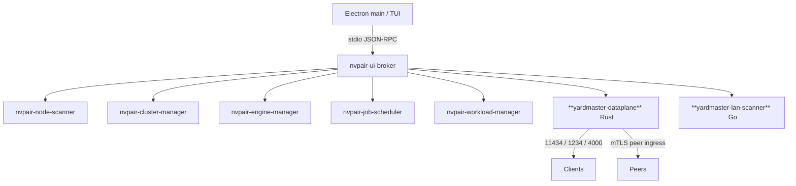

<!--
SPDX-FileCopyrightText: Copyright (c) 2026 Karl Miller
SPDX-License-Identifier: Apache-2.0
-->

# Architecture

This supersedes PAIR's `desktop/docs/architecture.mdx` for the merged system. It
assumes you have used PAIR and have not seen Switchyard.

## Process model (unchanged from PAIR, plus one worker)

Electron main (or the TUI) starts **one** broker, `nvpair-ui-broker`. The broker
supervises Go workers over newline-delimited JSON-RPC 2.0 on stdio. Yardmaster
keeps every PAIR worker — scanner, cluster manager, engine manager, job
scheduler, workloads, errors, manual nodes, node-info, node-settings — and makes
exactly two changes:

- **Adds `yardmaster-dataplane`** (Rust), a broker-supervised worker that
  **replaces** PAIR's `ollama-proxy` and `lmstudio-proxy`. It owns every
  inference-facing socket on the node.
- **Adds `yardmaster-lan-scanner`** (Go), a broker-supervised worker that
  discovers non-paired inference endpoints on the LAN.



The desktop never reimplements routing, scheduling, discovery, or cryptography —
that lives in a Go service or in the Rust data plane. `desktop/` is a client of
the broker's JSON-RPC surface through the typed preload bridge.

## The data plane

`crates/yardmaster-dataplane` is built from Switchyard crates consumed as pinned
git dependencies (`switchyard-protocol`, `switchyard-translation`,
`switchyard-libsy`, `switchyard-llm-client`, `switchyard-server`) — never forked
(see [decisions/0004](decisions/0004-switchyard-as-git-dependency.md)). It owns:

| Port | Ingress |
| --- | --- |
| 11434 | Ollama-compatible: `/api/chat`, `/api/generate`, `/api/tags`, `/api/show`, plus `/v1/*` |
| 1234 | OpenAI-compatible: `/v1/chat/completions`, `/v1/responses`, `/v1/models` |
| 4000 | Anthropic Messages `/v1/messages`, plus `/health` and `/metrics` |

Each port carries PAIR's **two-personalities-on-one-port** rule: first byte
`0x16` selects the mTLS cluster ingress; anything else is plaintext and is
refused with `403` unless the peer is loopback. Certificate and pin material
come from `nvpair-cluster-manager`'s on-disk files, read through
`crates/yardmaster-cluster-trust` — **one identity, one trust store**.

### Request pipeline

```
ingress translation  ->  model selection (Switchyard)  ->  placement (PAIR)
  ->  egress translation  ->  response/stream translation back to the client
```

- **Model selection** resolves the request's `model` to a route and runs its
  algorithm, producing a *logical model name* for a tier. Unknown model names
  synthesize a `passthrough` route so PAIR's zero-config flow is unchanged.
- **Placement** is `crates/yardmaster-placement`, a `switchyard-libsy`
  algorithm: capability gate → scheduler ordering → manual pin within the set →
  404-retryable failover. `pair_default` is byte-for-byte PAIR
  ([decisions/0019](decisions/0019-pair-default-placement-equivalence.md)).
- **Escalation and judge calls** go through placement and egress too. Judge
  models are placed like any other model and never leave the LAN unless the
  route sets `judge_egress = "allow"`.

The Ollama-native surface is a new crate,
`crates/yardmaster-ollama-translation`, over `switchyard-protocol` — vendored
Switchyard translation code is not modified.

## Metrics

`crates/yardmaster-metrics` is a first-class subsystem: one structured event per
request (no prompt/response text, ever), a SQLite (WAL) store in PAIR's data
directory, hourly/daily rollups, Prometheus on `:4000/metrics`, optional OTLP,
and `metrics.*` JSON-RPC for the UI. Peer events replicate over PAIR's existing
mTLS workload port. See [metrics.md](metrics.md).

## The agent layer

DeepSeek Harness (`dsh`) is the default agent experience, integrated — not
merged — through `packages/dsh-yardmaster` (a Cordis plugin) and
`packages/dsh-bundle-yardmaster` (a bundle + profiles). dsh owns sessions,
tools, sandboxing, approvals, the agent loop, and the agent UI; Yardmaster is
its model substrate. See [harness.md](harness.md).

## Repository layout

See [`../AGENTS.md`](../AGENTS.md#repository-layout). `services/` and `desktop/`
are vendored from PAIR via `git subtree`; `crates/` and `packages/` are
Yardmaster's; `patches/switchyard/` holds minimal build-time patches (empty
today).

## Build

`scripts/build.sh` (`build.ps1` on Windows) builds the Go services, the Rust
data plane, and the harness packages, staging runtime binaries into
`services/build/bin/` where PAIR's desktop build expects them. Requires
`cargo` 1.96.1, `go` 1.25+, and `pnpm`.
