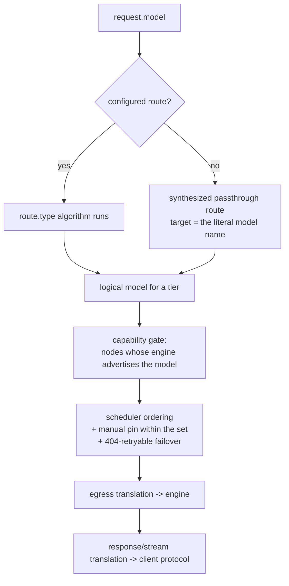

<!--
SPDX-FileCopyrightText: Copyright (c) 2026 Karl Miller
SPDX-License-Identifier: Apache-2.0
-->

# Routing

Yardmaster routes every request in two stages:

1. **Model selection** — a Switchyard routing algorithm on the route named by the
   request's `model` field picks a *logical model name* for a tier.
2. **Placement** — that logical model is resolved against the live cluster;
   PAIR's capability gate + scheduler ordering pick a node.

The two are orthogonal. Model selection never names a URL or a node; placement
never looks at request content.



## `yardmaster.toml`

One file, in PAIR's existing data directory. It is a **strict superset of
Switchyard's schema** — `schema_version`, `[llm_clients]`, `[targets]`,
`[routes]` all keep their Switchyard meaning (see the upstream
[TOML schema](https://github.com/NVIDIA-NeMo/Switchyard/blob/9a743e8/docs/reference/toml_schema.md))
— plus the Yardmaster tables below. Validation is as strict as
`switchyard-server --dry-run`: **unknown keys are rejected**.

Validate without starting anything:

```bash
yardmaster-dataplane dry-run --config yardmaster.toml
```

### Yardmaster tables

```toml,norun
[cluster]
# Read-only mirror of PAIR cluster state, written by the broker, never by you.
telemetry_auth = "plain"   # "plain" (default, PAIR-compatible) | "mtls"

[placement]
policy = "pair_default"    # "pair_default" (default) | "warm_first" | "vram_aware"

[egress]
allow_remote = false       # off by default; also needs the desktop toggle
allow_lan = true           # gates locality = "lan" targets

[ingress]
ollama_port = 11434
openai_port = 1234
anthropic_port = 4000
max_body_bytes = 33554432  # 32 MiB

[discovery]
lan_scan = false
subnets = []               # CIDRs; a public range here fails validation
probe_ports = [11434, 1234, 8000, 8080, 5000]
interval_s = 60
deny_hosts = []
list_unpromoted = false

[metrics]
retention_days = 30
otlp_endpoint = ""         # HTTPS or loopback only when set
prometheus = true
cost_tracking = true
local_cost_usd_per_million_tokens = 0.0

[harness]
enabled = true
dsh_version = "0.1.2-rc.1"
profile = "yardmaster-web"
port = 3080
prefer_user_install = true
```

### Targets gain a `locality`

```toml,norun
[targets.local_big]
id = "qwen4:72b"
locality = "cluster"       # default: a logical model resolved by placement, no URL

[targets.lab_box]
id = "llama-3.3-70b"
locality = "lan"           # OpenAI/Ollama/LM Studio endpoint on the LAN, not a paired node
llm_client = "lab_openai"

[targets.cloud_opus]
id = "anthropic/claude-opus-5"
locality = "remote"        # off unless [egress] allow_remote = true AND the UI toggle
provider = "openrouter"
```

### Providers

`[providers.<name>]` declares a remote or LAN provider; see
[providers.md](providers.md). Keys are never in this file — only
`api_key_env` or `api_key_ref`.

### Tiers

`[tiers.<name>]` declares an ordered, role-tagged model list; see
[plan-execute.md](plan-execute.md).

### Route additions

| Key | Applies to | Meaning |
| --- | --- | --- |
| `judge_egress` | `llm_classifier`, `escalation`, `plan_execute` | `"deny"` (default) keeps judge/classifier calls on cluster/LAN; `"allow"` permits a remote judge target (still needs `allow_remote`). |
| `type = "plan_execute"` | — | Yardmaster's planner/worker/judge algorithm. See [plan-execute.md](plan-execute.md). |

## One validated example per algorithm

Every block below is extracted and validated in CI (`docs` job).

### passthrough (also the zero-config default)

```toml
schema_version = 1

[targets]

[routes.default]
id = "qwen4:12b"
type = "passthrough"
target = "self"
```

### random

```toml
schema_version = 1

[targets.a]
id = "qwen4:12b"

[targets.b]
id = "nemotron-3.5-lightning"

[routes.spread]
id = "spread"
type = "random"
targets = ["a", "b"]
weights = [3, 1]
seed = 42
```

### stage_router

```toml
schema_version = 1

[targets.efficient]
id = "qwen4:12b"

[targets.capable]
id = "qwen4:72b"

[routes.staged]
id = "staged"
type = "stage_router"
capable_target = "capable"
efficient_target = "efficient"
picker = "efficient_first"
confidence_threshold = 0.6
recent_turn_window = 3
```

### llm_classifier (capability mode)

```toml
schema_version = 1

[targets.weak]
id = "qwen4:12b"

[targets.strong]
id = "qwen4:72b"

[targets.judge]
id = "qwen4:4b"

[routes.classified]
id = "classified"
type = "llm_classifier"
mode = "capability"
classifier_target = "judge"
weak_target = "weak"
strong_target = "strong"
base_threshold = 0.7
threshold_step = 0.1
judge_egress = "deny"
```

### escalation (llm_classifier, escalation mode)

```toml
schema_version = 1

[targets.weak]
id = "qwen4:12b"

[targets.strong]
id = "openrouter/deepseek/deepseek-v4"

[targets.judge]
id = "qwen4:4b"

[routes.escalate]
id = "escalate"
type = "llm_classifier"
mode = "escalation"
classifier_target = "judge"
weak_target = "weak"
strong_target = "strong"
judge_egress = "deny"
```

### plan_execute

```toml
schema_version = 1

[targets]

[tiers.planner]
role = "planner"
models = ["qwen4:72b", "openrouter/anthropic/claude-opus-5"]
max_cost_usd_per_1k_tokens = 0.05

[tiers.worker]
role = "worker"
models = ["qwen4:12b", "nemotron-3.5-lightning"]
max_cost_usd_per_1k_tokens = 0.002

[tiers.judge]
role = "judge"
models = ["qwen4:4b"]

[routes.plan-execute]
id = "plan-execute"
type = "plan_execute"
planner_tier = "planner"
worker_tier = "worker"
judge_tier = "judge"
escalate_on = ["tool_error", "repeated_failure", "long_context"]
demote_after_plan = true
judge_egress = "deny"
```

## Decision trace

Every request emits one decision trace (broker notification; also written as a
JSON line to the file named by `--log-routing-file`). Clicking a job in the
desktop **Jobs** view renders it. Fields:

| Field | Meaning |
| --- | --- |
| `request_id` | Correlates with the metrics event. |
| `route`, `algorithm` | The route hit and its `type`. |
| `tier_decided` | Tier the algorithm chose. |
| `rule` | For `plan_execute`: the exact rule that fired (`hint:header`, `signal:first_user_turn`, `judge`, `escalate:tool_error`, `demote_after_plan`, ...). |
| `signals` / `judge_verdict` | Signal scores or the judge's structured verdict. |
| `logical_model` | The tier target selected. |
| `candidate_set` | Node/endpoint ids after the capability gate. |
| `ordering` | Scheduler order applied, and whether a manual pin was honored. |
| `node_chosen` | Where it ran. |
| `failovers` | Each 404-retry and the node it moved to. |
| `locality` | `cluster` / `lan` / `remote`. |

No prompt or completion text ever appears in a trace.
